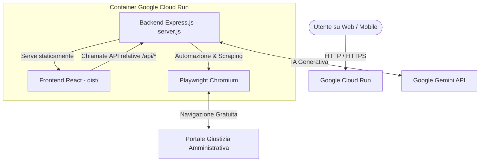

# Progetto: Ricerca e Riassunto Sentenze TAR

Questo documento riassume i requisiti del progetto, l'architettura tecnica implementata, lo stato attuale del deploy e le linee guida per i futuri sviluppi.

---

## 1. Stato Attuale del Progetto

Il progetto è ora **completamente sviluppato, containerizzato e pubblicato online**.
L'applicazione è accessibile pubblicamente da qualsiasi PC, tablet o smartphone al seguente URL:
👉 **[https://tar-scraper-summarizer-109151405780.europe-west8.run.app](https://tar-scraper-summarizer-109151405780.europe-west8.run.app)**

### Come funziona il Deploy Automatico (Continuous Deployment):
Ogni volta che effettuiamo una modifica al codice e facciamo il `git push` sulla branca `main` di GitHub, **Google Cloud Build** avvia automaticamente la compilazione del Dockerfile e aggiorna il sito live su Cloud Run in circa 2-3 minuti. Non serve fare alcun deploy manuale.

---

## 2. Architettura Implementata (Full-Stack Unificato)

Per semplificare la gestione ed evitare costi aggiuntivi, abbiamo unito il Frontend (React) e il Backend (Express) in un'unica immagine Docker. Il server Express fa da "host" per entrambi.



### Dettagli del Container:
- **Porta**: `8080` (utilizzata internamente e gestita da Cloud Run).
- **Risorse**: `2 GiB di RAM` e `1 vCPU` (necessari per consentire a Playwright di lanciare il browser Chromium in modalità headless per lo scraping).
- **IA**: Utilizza l'SDK `@google/genai` con il modello `gemini-2.0-flash`.

---

## 3. Riepilogo delle Modifiche Apportate

Ecco l'elenco dei file creati e modificati nel progetto per consentire questo setup:

### A. File Creati (Nuovi)

1. **[Dockerfile](file:///c:/Users/marin/Progetti/TAR/Dockerfile) (nella root del progetto)**:
   Gestisce la build multi-stage:
   - **Stage 1 (Compilazione Frontend)**: Installa le dipendenze in `/app/frontend` ed esegue `npm run build` per generare i file statici (HTML, CSS, JS) nella cartella `dist/`.
   - **Stage 2 (Server di Produzione)**: Parte dall'immagine di Microsoft Playwright, installa le dipendenze del backend, copia il codice del server ed inserisce i file del frontend compilati all'interno della struttura del backend.
2. **[.dockerignore](file:///c:/Users/marin/Progetti/TAR/.dockerignore) (nella root del progetto)**:
   Esclude file inutili (come `node_modules` locali o file `.env` con chiavi private) per rendere il build su Cloud Build leggero e sicuro.
3. **[polyfill.js](file:///c:/Users/marin/Progetti/TAR/backend/polyfill.js) (nel backend)**:
   Risolve un problema di compatibilità con versioni di Node.js inferiori alla 20.16.0 (come quella presente nel container di Google). Esegue il polyfill di `process.getBuiltinModule` prima del caricamento delle librerie.

### B. File Modificati

1. **[server.js](file:///c:/Users/marin/Progetti/TAR/backend/server.js) (del backend)**:
   - Importato `polyfill.js` nella primissima riga per evitare crash all'avvio.
   - Aggiunto il middleware `express.static` per servire la cartella del frontend compilato (`../frontend/dist`).
   - Aggiunta una rotta di fallback `*` che rimanda a `index.html` per permettere il corretto funzionamento delle Single Page Application (SPA).
2. **[App.jsx](file:///c:/Users/marin/Progetti/TAR/frontend/src/App.jsx) (del frontend)**:
   - Configurato `API_URL` per default come stringa vuota `''` (percorsi relativi). In questo modo, quando l'applicazione gira sul cloud, le chiamate API verso `/api/search` o `/api/summarize` vengono inviate in automatico allo stesso server che ospita la pagina, senza bisogno di configurare URL fissi.
3. **[vite.config.js](file:///c:/Users/marin/Progetti/TAR/frontend/vite.config.js) (del frontend)**:
   - Aggiunto il parametro `base: './'` per garantire che i percorsi delle risorse compilate (CSS/JS) siano relativi e caricati correttamente dal server.

---

## 4. Configurazione delle Variabili d'Ambiente

Le credenziali e chiavi API non sono salvate nel codice per motivi di sicurezza, ma sono iniettate all'avvio da Cloud Run:
- **`GEMINI_API_KEY`**: La chiave di Google Gemini utilizzata per generare le sintesi delle sentenze.
- **`BROWSERLESS_TOKEN`** *(Opzionale)*: Se presente, il backend delegherà lo scraping a Browserless.io anziché usare il Chromium locale del container.

---

## 5. Linee Guida per Modifiche Future

Quando vorremo fare modifiche al progetto, il flusso consigliato è:

1. **Sviluppo Locale**:
   - Avvia il backend localmente:
     ```bash
     cd backend
     npm start # Avvia su http://localhost:10000 (o porta definita in .env)
     ```
   - Avvia il frontend in modalità sviluppo:
     ```bash
     cd frontend
     npm run dev # Avvia l'interfaccia interattiva con hot-reload
     ```
2. **Push e Rilascio**:
   Una volta completate e testate le modifiche localmente, esegui semplicemente:
   ```bash
   git add .
   git commit -m "Descrizione della tua modifica"
   git push origin main
   ```
   *Google Cloud si occuperà del resto, aggiornando l'app online.*
