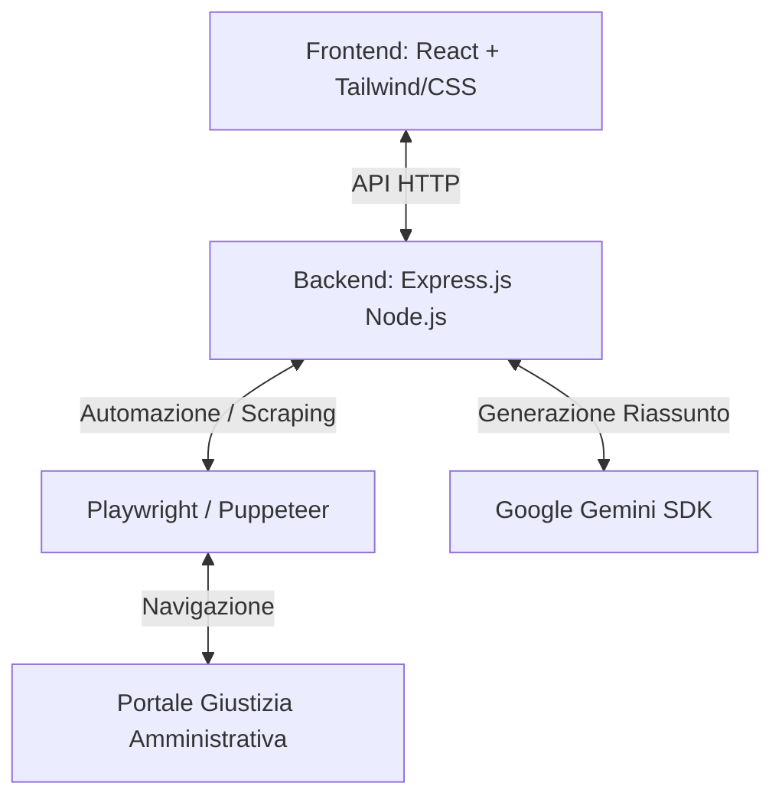

# Progetto: Ricerca e Riassunto Sentenze TAR

Questo documento riassume i requisiti del progetto e propone l'architettura tecnica per realizzarlo.

---

## 1. Sintesi dei Requisiti

Un avvocato ha la necessità di studiare le sentenze emesse dai vari Tribunali Amministrativi Regionali (TAR) e dal Consiglio di Stato. Il flusso operativo desiderato è:
1. **Input Utente:** L'utente inserisce delle parole chiave di ricerca in un'interfaccia web.
2. **Automazione Ricerca:** Il sistema si collega al portale ufficiale della Giustizia Amministrativa (sezione "Decisioni e Pareri").
3. **Compilazione Campo:** Inserisce le parole chiave nel campo **"Ricerca libera"** ed avvia la ricerca.
4. **Scraping dei Risultati:** Legge l'elenco di tutti i provvedimenti trovati (titolo, sede, data, link al documento).
5. **Estrazione e Riassunto (Test):** Si collega al documento citato nel primo risultato (solitamente un file PDF o una pagina web dettagliata della sentenza), ne estrae il testo e genera un **riassunto intelligente** (utilizzando l'IA di Google Gemini) per consentire all'avvocato di capire rapidamente se vale la pena approfondire la lettura o passare alla sentenza successiva.

---

## 2. Architettura del Progetto

Il progetto sarà strutturato come un'applicazione web full-stack locale:

### Componente Frontend (Interfaccia Utente)
- Sviluppata in **React (tramite Vite)** per offrire un'esperienza moderna, reattiva e premium.
- **Interfaccia Grafica:** Un design elegante, scuro/ibrido con accenti di colore professionali (blu reale, ardesia, oro), animazioni fluide e visualizzazione immediata.
- **Funzionalità:**
  - Form per l'inserimento delle parole chiave e filtri opzionali.
  - Pulsante per avviare la ricerca con indicatore di caricamento animato.
  - Lista interattiva dei risultati trovati con dettagli chiave (Sede del TAR, Data, Numero).
  - Pannello laterale o sezione dedicata per visualizzare il **Riassunto IA** della sentenza selezionata.
  - Pulsanti per richiedere il riassunto di altre sentenze nell'elenco.

### Componente Backend (Server e Automazione)
- **Tecnologia:** Node.js con Express.js.
- **Automazione & Scraping (Playwright):** Utilizzeremo Playwright per navigare nel portale `giustizia-amministrativa.it`, compilare il form di ricerca con le parole chiave dell'utente, inviare la ricerca, e leggere la lista dei risultati.
- **Estrazione PDF/Testo:** Playwright scaricherà o navigherà all'interno del PDF/provvedimento del primo risultato (o di quelli selezionati) ed estrarrà il testo grezzo della sentenza.
- **Integrazione IA (Google Gemini API):** Il server utilizzerà l'SDK ufficiale di Gemini per inviare il testo della sentenza ed elaborare un riassunto legale strutturato in lingua italiana (es. Oggetto della controversia, Decisione del TAR, Motivazioni principali, Punti chiave).

---

## 3. Tecnologie Utilizzate

1. **Frontend:** React, Vite, CSS moderno (layout flessibili, animazioni, estetica professionale).
2. **Backend:** Node.js, Express.js, Cors, Dotenv.
3. **Automazione:** Playwright (ideale per gestire i portali governativi che fanno ampio uso di Javascript e caricamento dinamico).
4. **IA:** `@google/genai` (SDK ufficiale di Google Gemini) per il riassunto dei testi legali.
